# Map the Budda’s franchise platform sitemap and user flows

**Document:** Sitemap and user flows  
**Product:** Budda’s franchise recruitment site and operator portal  
**Version:** 1.0  
**Date:** August 21, 2026  
**Status:** Proposed interaction baseline  
**Primary audience:** Product, franchise development, operations, design, engineering, legal, and quality assurance  
**Source documents:** Discovery Brief v1.0, Scope and Requirements v1.0, Franchise Website PRD v1.0  

This document defines the site hierarchy, navigation, user journeys, system handoffs, state transitions, analytics, and acceptance criteria for franchise lead capture, qualified booking, operator account activation, and portal checkout.

## 1. Executive summary

The platform has two navigation environments:

1. **Public franchise site:** Educates prospects, establishes fit, and captures qualified interest
2. **Protected operator portal:** Supports approved operators with supplies, orders, resources, support, and account context

Four flow rules govern the system:

- **Lead capture:** Public and available to eligible visitors
- **Booking:** Private and available only after qualification or human review
- **Account creation:** Invite-only after operator and location approval
- **Checkout:** Protected and available only to an authenticated user with an authorized location

The public site does not collect franchise payments, reserve territories, create portal accounts, or guarantee meetings. The portal does not use public prospect identity or share data across locations.

## 2. Flow principles

### 2.1 One primary action per stage

- Discovery pages lead to evidence
- Evidence pages lead to fit
- Fit pages lead to inquiry
- Inquiry success leads to review
- Qualification may lead to booking
- Franchise approval may lead to account invitation
- Portal catalog leads to cart and checkout

### 2.2 Progressive commitment

Ask for information only when the next system or person will use it:

- Public browsing requires no account
- Inquiry requires contact, market, experience, readiness, and consent
- Booking requires a qualified inquiry
- Account activation requires an approved invitation
- Checkout requires authenticated location access

### 2.3 Mutual evaluation

Inquiry, booking, account invitation, and checkout are different commitments:

- An inquiry is not an application
- A booking is not an approval
- An account is not a franchise award unless the approved legal process says so
- A checkout confirmation is not fulfillment until the system of record accepts the order

### 2.4 Server authority

The browser may request a transition. The server verifies:

- Form integrity
- Qualification and booking eligibility
- Invitation state
- Session and role
- Location access
- Product and price
- Inventory or availability
- Order and payment state

### 2.5 Recoverable failure

Every flow defines:

- Invalid input
- Expired state
- Duplicate action
- Provider timeout
- Partial success
- Retry
- Manual recovery
- Safe user message

## 3. Sitemap

### 3.1 ASCII page hierarchy

```text
Root (/)
└── Franchise home (/franchise)
    ├── About (/franchise/about)
    ├── Why Budda's (/franchise/why-buddas)
    ├── The opportunity (/franchise/the-opportunity)
    ├── Process (/franchise/process)
    ├── FAQ (/franchise/faq)
    ├── Contact and inquiry (/franchise/contact)
    └── Operator login (/franchise/login)

Legal and trust
├── Privacy (/privacy)
├── Terms (/terms)
└── Accessibility (/accessibility)

Protected operator portal (/portal)
├── Dashboard (/portal)
├── Supplies (/portal/supplies)
│   └── Supply detail (/portal/supplies/[slug])
├── Cart (/portal/cart)
├── Checkout (/portal/checkout)
│   └── Confirmation (/portal/checkout/confirmation)
├── Orders (/portal/orders)
├── Resources (/portal/resources)
├── Support (/portal/support)
└── Account (/portal/account)

External or non-indexed service states
├── Qualified booking link (scheduling provider or signed redirect)
├── Operator invitation (identity provider)
├── Email verification (identity provider)
├── Multi-factor enrollment (identity provider)
└── Payment page when approved (payment provider)
```

### 3.2 Basic Mermaid sitemap

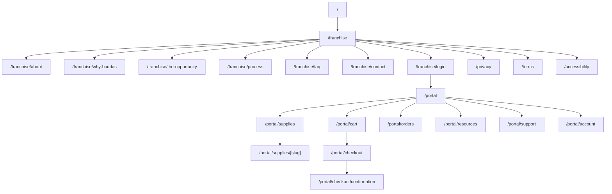

### 3.3 Styled Mermaid sitemap

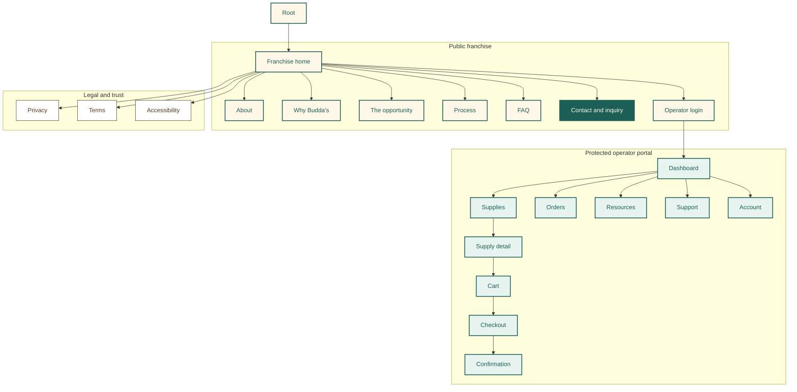

### 3.4 URL map

| Page | URL | Parent | Navigation | Indexing | Primary action |
| --- | --- | --- | --- | --- | --- |
| Root | `/` | None | None | Redirect | Visit franchise home |
| Franchise home | `/franchise` | Root | Logo | Index | Explore opportunity |
| About | `/franchise/about` | Franchise | Header/footer | Index | Understand origin |
| Why Budda’s | `/franchise/why-buddas` | Franchise | Header/footer | Index | Evaluate distinction |
| The opportunity | `/franchise/the-opportunity` | Franchise | Header/footer | Index | Assess fit |
| Process | `/franchise/process` | Franchise | Header/footer | Index | Understand steps |
| FAQ | `/franchise/faq` | Franchise | Header/footer | Index | Resolve questions |
| Contact | `/franchise/contact` | Franchise | Primary CTA | Index | Submit inquiry |
| Operator login | `/franchise/login` | Franchise | Secondary | Noindex | Sign in |
| Privacy | `/privacy` | Root | Footer/form | Index | Understand data use |
| Terms | `/terms` | Root | Footer | Index | Understand terms |
| Accessibility | `/accessibility` | Root | Footer | Index | Review commitment |
| Portal dashboard | `/portal` | Login | Portal nav | Noindex | Start operator task |
| Supplies | `/portal/supplies` | Portal | Portal nav | Noindex | Select supply |
| Supply detail | `/portal/supplies/[slug]` | Supplies | Contextual | Noindex | Add to cart |
| Cart | `/portal/cart` | Portal | Portal nav | Noindex | Review order |
| Checkout | `/portal/checkout` | Cart | Sequential | Noindex | Place order |
| Confirmation | `/portal/checkout/confirmation` | Checkout | Sequential | Noindex | Review receipt |
| Orders | `/portal/orders` | Portal | Portal nav | Noindex | Review status |
| Resources | `/portal/resources` | Portal | Portal nav | Noindex | Open resource |
| Support | `/portal/support` | Portal | Portal nav | Noindex | Create case |
| Account | `/portal/account` | Portal | Portal nav | Noindex | Manage context |

### 3.5 Redirect map

| Source | Destination | Type | Reason |
| --- | --- | --- | --- |
| `/` | `/franchise` | Framework redirect | One public entry |
| `/franchisee-login` | `/franchise/login` | Permanent | Canonical login |
| `/portal/store` | `/portal/supplies` | Permanent | Remove duplicate catalog |
| `/portal/store/[slug]` | `/portal/supplies/[slug]` | Permanent | Remove duplicate product page |

Redirects may preserve a valid, server-approved `locationId`. They must discard external or unrecognized destinations.

## 4. Navigation flows

### 4.1 Public navigation

Primary header order:

1. Why Budda’s
2. The opportunity
3. Process
4. FAQ
5. Contact
6. Operator login

Rules:

- Logo returns to `/franchise`
- Contact is the only primary button
- Operator login remains secondary
- Mobile navigation preserves order and labels
- Current route uses text, shape, underline, or icon in addition to color
- Focus moves into and returns from the mobile menu predictably

### 4.2 Portal navigation

Primary portal order:

1. Dashboard
2. Supplies
3. Cart
4. Orders
5. Resources
6. Support
7. Account

Rules:

- Location switcher appears only for users with more than one authorized location
- Cart count includes only accessible locations
- Location changes revalidate the route
- Sign out remains available without opening Account
- Portal navigation does not expose public prospect flows

### 4.3 Internal linking plan

| Source | Required contextual destinations |
| --- | --- |
| Franchise home | Why Budda’s, opportunity, process, FAQ, contact |
| About | Why Budda’s, contact |
| Why Budda’s | Opportunity, contact |
| Opportunity | Process, FAQ, contact |
| Process | FAQ, contact |
| FAQ | Opportunity, process, contact |
| Contact | Privacy, process, consumer site after success |
| Portal dashboard | Supplies, orders, resources, support |
| Supply detail | Supplies, cart |
| Confirmation | Orders, supplies |
| Support | Orders or resource when referenced |

No public or protected page may remain orphaned.

## 5. Lead-capture flow

### 5.1 Purpose

The lead flow captures enough information to evaluate fit and route follow-up. It does not complete a franchise application or grant access to booking.

### 5.2 Entry points

- Franchise-home hero
- Opportunity page
- Process page
- FAQ
- Final page calls to action
- Organic search
- Approved franchise directory
- Direct outreach
- Campaign link

Every entry preserves first-touch and latest-touch attribution without placing personal data in analytics.

### 5.3 Lead journey

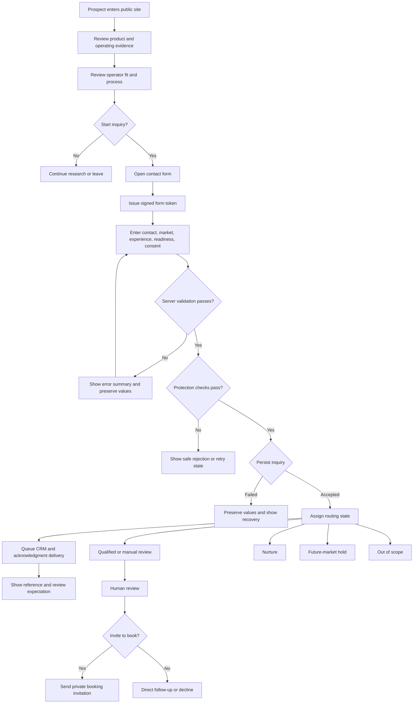

### 5.4 Form structure

The flow uses three logical steps.

#### Step 1: Contact and market

Fields:

- First name
- Last name
- Email
- Optional phone
- City and state
- Market of interest

#### Step 2: Experience

Fields:

- Relevant restaurant, hospitality, or business experience
- Current operating role
- Current unit count when approved
- Franchise experience when approved

#### Step 3: Readiness and consent

Fields:

- Approved non-financial capital-readiness band
- Preferred timeline
- Optional message
- Consent to respond
- Optional consent for future updates

The form may retain the current one-page visual layout while grouping fields semantically. A multi-step interface should be tested before replacing the existing production form.

### 5.5 Form Health and Friction Index

| Category | Score |
| --- | ---: |
| Field necessity and efficiency | 23 / 30 |
| Value and effort balance | 16 / 20 |
| Cognitive load and clarity | 16 / 20 |
| Error handling and recovery | 12 / 15 |
| Trust and friction reduction | 7 / 10 |
| Mobile usability | 4 / 5 |
| **Total** | **78 / 100** |

**Verdict:** Usable with friction.

The form requires qualification data, so field count alone is not a defect. The primary risks are unclear use of fields, missing progress cues, premature financial specificity, and lack of field-level analytics.

### 5.6 Lead states

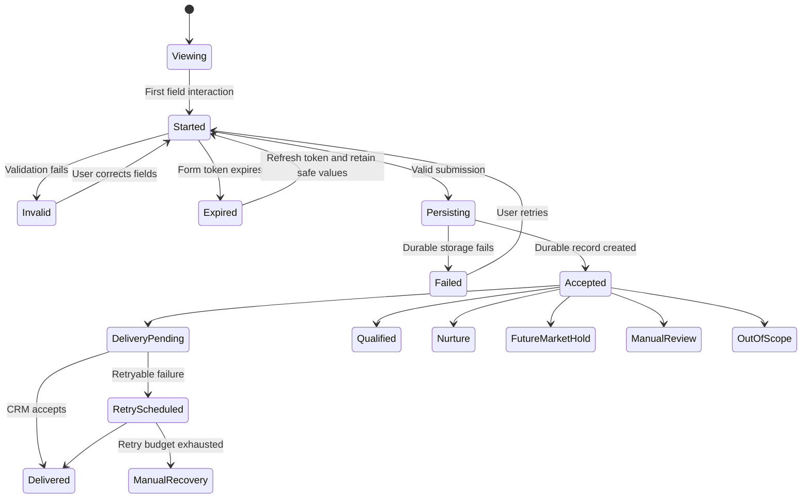

### 5.7 Lead success state

Show:

- Confirmation that the inquiry was received
- Public reference number
- Current review expectation
- Statement that inquiry does not guarantee contact, approval, territory, or offer
- Link to process
- Link to consumer site or brand story

Do not show:

- Booking calendar before qualification
- Portal account creation
- Territory reservation
- Franchise Disclosure Document download unless Release 2 permits it
- Financial-performance content not already approved

### 5.8 Lead analytics

Track:

- `franchise_page_view`
- `franchise_cta_click`
- `franchise_form_view`
- `franchise_form_start`
- `franchise_form_step_view`
- `franchise_form_step_complete`
- `franchise_form_error`
- `franchise_form_submit_attempt`
- `generate_lead` after durable persistence
- `franchise_routing_state`
- `franchise_delivery_state`
- `franchise_followup_started`
- `franchise_booking_invited`

Exclude:

- Name
- Email
- Phone
- Message text
- Raw market address
- Exact financial values

### 5.9 Lead acceptance criteria

- A visitor can reach the inquiry from every primary public route
- A valid inquiry creates one durable record
- A duplicate idempotency key returns the original reference
- Invalid fields retain valid values
- Error summary receives focus
- JavaScript-disabled submission works
- CRM outage does not lose an accepted inquiry
- Every accepted inquiry receives one routing state
- Every inquiry records form, content, legal, and consent versions
- Success does not expose booking or account creation
- Analytics contains no direct identifiers

## 6. Qualified-booking flow

### 6.1 Booking policy

Booking is not a public acquisition step. A prospect becomes eligible only after:

- Inquiry persistence
- Routing to qualified or manual review
- Human or approved rule-based review
- Assignment to an authorized franchise-development host
- Creation of a single-purpose booking invitation

Calendly supports routing qualified visitors to different hosts or destinations based on form answers. Budda’s may use this pattern, but the selected vendor remains an integration choice. [Calendly Routing Forms](https://help.calendly.com/hc/en-us/articles/4418606043927-Getting-started-with-Routing-Forms).

### 6.2 Booking flow

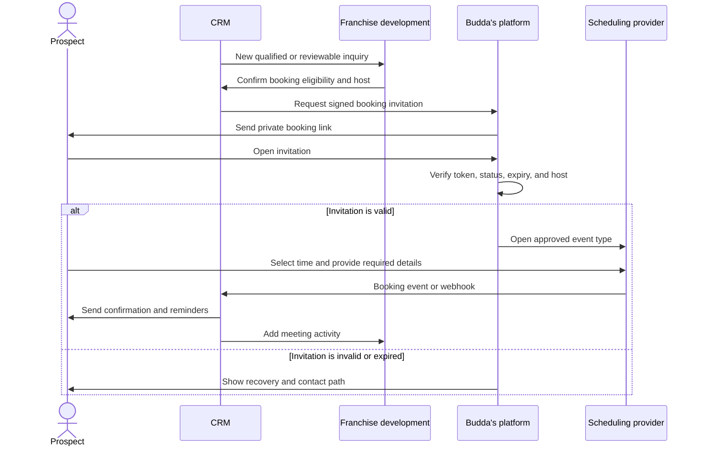

### 6.3 Booking states

- Not eligible
- Eligible
- Invitation pending
- Invitation sent
- Opened
- Booked
- Rescheduled
- Canceled by prospect
- Canceled by Budda’s
- No-show
- Completed
- Expired
- Manual recovery

### 6.4 Booking requirements

- Invitation must be private and non-indexed
- Link must be signed, single-purpose, and time-limited
- Link must map to one prospect, inquiry, host pool, and event type
- Provider must not expose internal calendars beyond available times
- Booking must update the CRM
- Reschedule and cancellation must update the same activity
- Time zone must be explicit
- Confirmation and reminders must use approved copy
- Calendar details must not include sensitive inquiry text
- Booking failure must not change inquiry qualification

### 6.5 Booking exclusions

- Public calendar on the franchise homepage
- Meeting availability before inquiry
- Booking as proof of qualification
- Automatic franchise-sales call for out-of-scope inquiries
- Unbounded meeting types
- Calendar access for unapproved staff

### 6.6 Booking acceptance criteria

- Unqualified visitors cannot access scheduling
- Expired or tampered invitations fail safely
- Qualified invitation opens the correct host or routing pool
- Booking, reschedule, cancel, and no-show states synchronize to CRM
- Confirmation displays local time and time zone
- Provider outage shows a direct recovery path
- Duplicate provider webhooks do not create duplicate activities
- Booking link and meeting details remain out of analytics

## 7. Operator account-creation flow

### 7.1 Account policy

The portal has no public signup. Budda’s creates an invitation only after:

- The operator relationship reaches the approved activation stage
- Legal and operational prerequisites are complete
- Franchise organization exists
- Location exists or has an approved pre-opening state
- Role and location grants are defined
- Identity owner approves activation

The selected identity provider owns credential capture, email verification, password or passkey policy, multi-factor authentication, recovery, and revocation.

### 7.2 Invitation flow

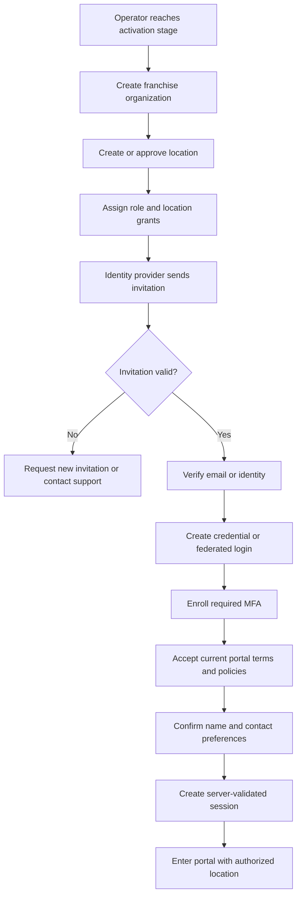

### 7.3 Account states

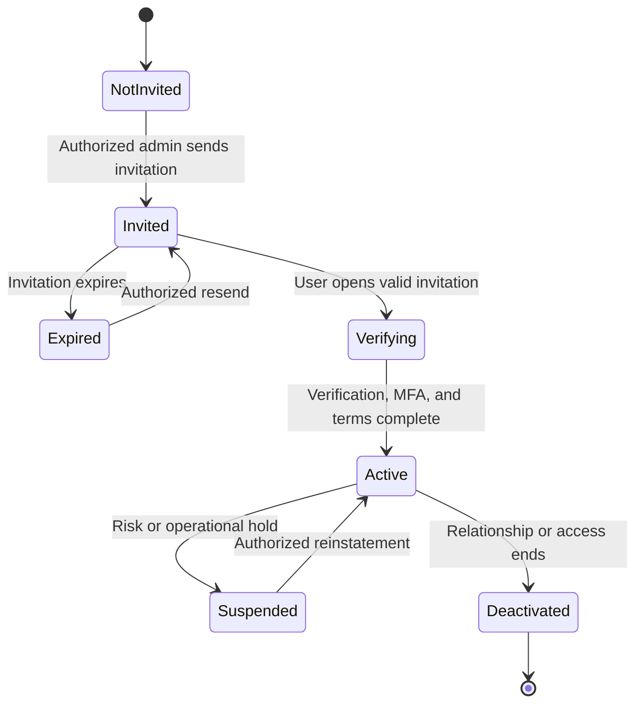

### 7.4 Minimum activation fields

Required before invitation:

- Legal or operating organization identifier
- User email
- User name
- Role
- Authorized location or managed-location set
- Invitation owner
- Invitation expiry

Collected during activation only when needed:

- Authentication method
- Multi-factor method
- Contact preference
- Current terms and policy acknowledgment

Defer:

- Profile photo
- Biography
- Demographic data
- Personal phone when not required
- Mailing address when not required for the role

### 7.5 Account security rules

- Invitation token is one-time and time-limited
- Email is not proof of role or location
- Server retrieves grants from the authoritative source
- Session rotates after activation and privilege change
- Recovery cannot bypass multi-factor or administrative controls
- Deactivation revokes active sessions
- Role changes generate audit events
- Administrator cannot grant a location outside their own authority

Next.js recommends validating authentication and authorization in Server Actions and Route Handlers, not relying on an optimistic proxy check alone. [Next.js authentication guide](https://nextjs.org/docs/app/guides/authentication).

### 7.6 Account analytics

Operational metrics:

- Invitation created
- Invitation delivered
- Invitation opened
- Verification complete
- Multi-factor enrollment complete
- Terms accepted
- Activation complete
- Activation error
- Invitation expired
- Resend
- Suspension and deactivation

Do not send credential, token, or authentication-factor data to product analytics.

### 7.7 Account acceptance criteria

- No public self-registration route exists
- Only an authorized administrator can invite
- Invite is bound to intended organization and role
- Expired and reused invites fail
- Multi-factor requirement enforces before portal access
- Terms version is stored
- Session contains no unverified client-supplied grant
- Cross-tenant access tests fail
- Deactivation revokes sessions
- User receives a clear recovery path

## 8. Login and recovery flow

### 8.1 Login

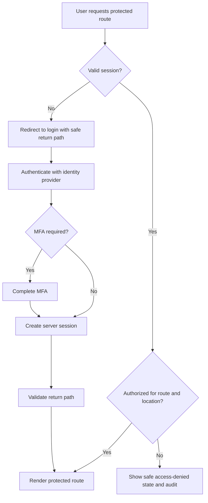

### 8.2 Recovery

Recovery remains with the identity provider:

- Request recovery
- Verify approved channel
- Complete provider risk checks
- Reset credential or passkey
- Re-enroll multi-factor when policy permits
- Revoke prior sessions
- Notify user
- Audit event

The app must never reveal whether an email belongs to an operator.

## 9. Portal checkout flow

### 9.1 Checkout policy

Portal checkout purchases approved operating supplies. It does not accept franchise fees, territory deposits, royalties, or consumer food orders.

The preferred initial production model is approved internal invoicing. Card payment remains conditional. The team must select one model before implementation:

1. Internal invoice or account billing
2. Purchase order approval
3. Hosted payment provider

The user flow must not combine these models without a clear business rule.

### 9.2 Catalog-to-order flow

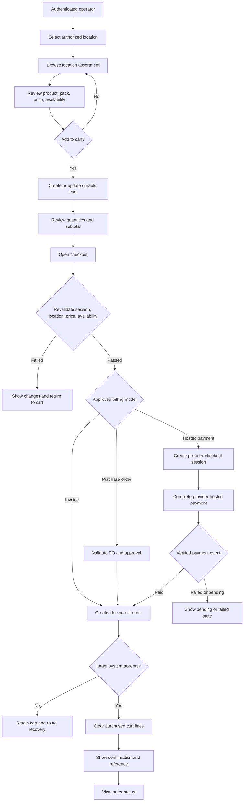

### 9.3 Checkout sequence

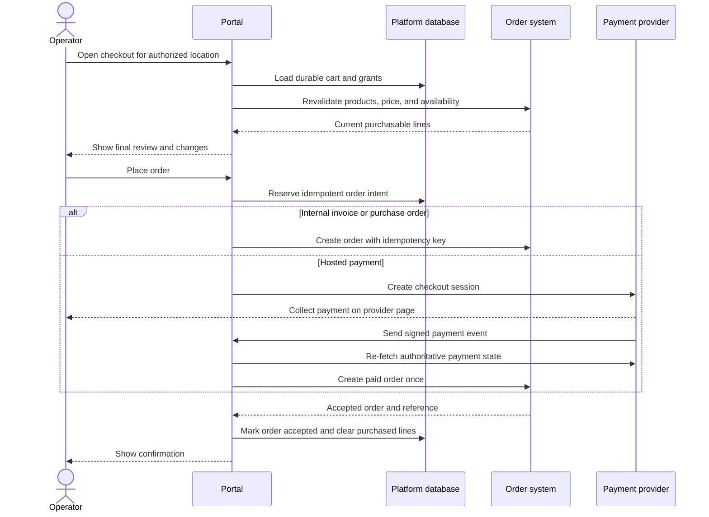

### 9.4 Cart states

- Empty
- Active
- Price changed
- Availability changed
- Partially unavailable
- Expired
- Submitted
- Superseded

### 9.5 Order states

- Draft intent
- Validation failed
- Billing pending
- Payment pending
- Payment failed
- Submitted
- Accepted
- Processing
- Shipped
- Delivered
- Canceled
- Manual review

### 9.6 Payment boundary

If card payment is approved:

- Use a provider-hosted page or provider-hosted fields
- Never collect, store, or log raw card data
- Verify webhook signatures
- Preserve raw webhook body for signature verification
- Re-fetch payment state server-side
- Process each event once
- Separate payment success from order acceptance
- Reconcile payment and order records
- Define refund, dispute, and cancellation flows

Stripe’s official guidance requires webhook-driven fulfillment because the user may never return to the success page. It also requires idempotent fulfillment because the same event can arrive more than once. [Stripe fulfillment](https://docs.stripe.com/checkout/fulfillment).

PCI Security Standards Council guidance states that an embedded payment page can qualify for SAQ A only when all payment-page elements originate from the compliant provider, subject to the full eligibility criteria. [PCI SSC FAQ 1438](https://www.pcisecuritystandards.org/faqs/1438/).

### 9.7 Checkout acceptance criteria

- User must have a valid session
- Location must be authorized
- Cart must belong to the location
- Server revalidates product, quantity, price, and availability
- Changes appear before final submission
- Place-order action uses an idempotency key
- Double click or retry creates one order
- Failure preserves the cart
- Confirmation appears only after authoritative order acceptance
- Payment redirect alone never proves payment
- Verified provider event cannot create duplicate fulfillment
- Purchased lines clear only after order acceptance
- Confirmation includes order reference, location, lines, total, billing state, and next step
- Order appears in history

## 10. Support flow

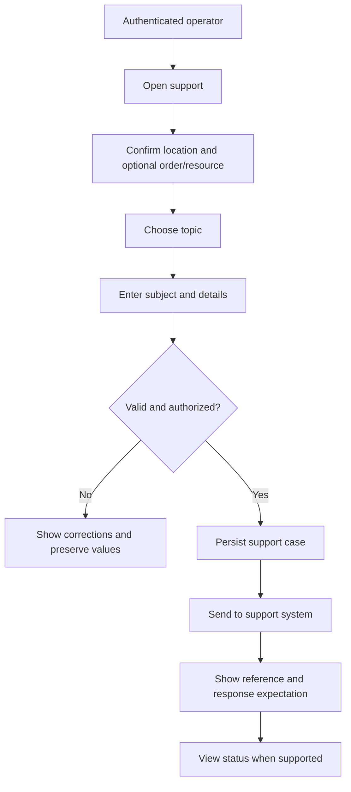

Support must remain location-scoped and must not include credentials, card data, or unnecessary sensitive information.

## 11. Analytics by flow

### 11.1 Lead funnel

```text
Session
→ Evidence viewed
→ Fit viewed
→ Inquiry viewed
→ Inquiry started
→ Valid submission
→ Durable lead
→ Qualified review
→ Booking invited
→ Booking completed
```

### 11.2 Account funnel

```text
Invitation created
→ Delivered
→ Opened
→ Identity verified
→ MFA complete
→ Terms accepted
→ Account active
→ First portal task complete
```

### 11.3 Checkout funnel

```text
Catalog viewed
→ Product viewed
→ Added to cart
→ Cart reviewed
→ Checkout started
→ Revalidation passed
→ Billing complete
→ Order accepted
→ Confirmation viewed
```

### 11.4 Flow metrics

| Flow | Primary metric | Guardrail metrics |
| --- | --- | --- |
| Lead capture | Qualified inquiries per eligible session | Completion, error, duplicate, out-of-scope |
| Booking | Qualified bookings completed | Time to book, cancel, reschedule, no-show |
| Account activation | Activated invited users | Expiry, resend, error, recovery |
| Checkout | Accepted orders per valid checkout | Price change, failure, duplicate, payment/order mismatch |
| Support | Durable cases routed correctly | Error, delivery delay, reassignment |

## 12. Flow exclusions

### Lead capture

- No territory reservation
- No franchise application completion
- No financial-performance projection
- No public booking
- No portal signup

### Booking

- No anonymous scheduling
- No automatic meeting for every inquiry
- No meeting as implied approval
- No internal calendar details in public payloads

### Account creation

- No public registration
- No shared operator accounts
- No client-selected role or location
- No password or multi-factor implementation inside the app when a provider owns it

### Checkout

- No franchise fee, royalty, territory deposit, or consumer order
- No raw card handling
- No order confirmation from a client redirect alone
- No checkout without location authorization
- No inventory assumption from stale page data

## 13. Cross-flow failure matrix

| Failure | Lead | Booking | Account | Checkout |
| --- | --- | --- | --- | --- |
| Token expired | Refresh form token | Request new invitation | Resend identity invite | Reopen current cart |
| Provider unavailable | Persist and queue delivery | Show recovery path | Show provider status and support | Preserve cart and order intent |
| Duplicate action | Return original reference | Reuse existing booking | Reject used invite | Return existing order |
| Authorization changed | Not applicable | Revoke booking eligibility | Revoke invite/session | Block and preserve safe cart |
| Network lost after submit | Reconcile by idempotency | Confirm provider state | Resume provider activation | Reconcile order/payment |
| Stale content/data | Remove or label claim | Refresh host availability | Refresh grants | Revalidate price and inventory |
| Manual review required | Queue lead | Hold invitation | Hold activation | Hold order |

## 14. Accessibility requirements

All flows meet WCAG 2.2 AA:

- Visible and unobscured focus
- Logical focus order
- Persistent labels
- Programmatic instructions
- Error summary and field relationships
- Status announcements
- Keyboard operation
- 200% zoom
- 320 CSS pixel reflow
- Reduced motion
- Minimum target size and spacing

Additional flow requirements:

- Progress indicators announce the current step
- Scheduling provider receives accessibility review
- Identity provider activation receives keyboard and screen-reader testing
- Hosted payment flow receives accessibility testing
- Provider redirects return focus to a meaningful heading

## 15. Search and indexing requirements

- Public content pages may be indexed
- Contact may be indexed with approved metadata
- Login, portal, booking invitations, identity activation, checkout, and confirmations are noindex
- Signed or tokenized URLs never appear in the XML sitemap
- Canonical routes exclude state and flow tokens
- Redirect aliases are not canonical
- Structured data matches visible public content

## 16. Test scenarios

### 16.1 Lead

1. Valid submission
2. Invalid email
3. Missing consent
4. Expired token
5. Honeypot
6. Duplicate keys
7. Duplicate idempotency
8. Storage failure
9. CRM timeout
10. JavaScript disabled
11. Screen reader errors
12. Mobile keyboard and autofill

### 16.2 Booking

1. Eligible invitation
2. Unqualified visitor
3. Expired invitation
4. Wrong prospect
5. Host unavailable
6. Reschedule
7. Cancel
8. Duplicate webhook
9. No-show
10. Provider outage

### 16.3 Account

1. Valid invitation
2. Expired invitation
3. Reused invitation
4. Wrong organization
5. Multi-factor failure
6. Terms not accepted
7. Suspended account
8. Deactivated account
9. Role changed during session
10. Cross-tenant access

### 16.4 Checkout

1. Empty cart
2. Unauthorized location
3. Price change
4. Unavailable item
5. Quantity limit
6. Double submit
7. Order provider timeout
8. Payment success and order failure
9. Duplicate payment event
10. Browser closes before return
11. Cart retained after failure
12. Confirmation and order history agree

## 17. Implementation sequence

### Phase 1: Public navigation and lead capture

- Canonical routes and redirects
- Internal links
- Durable inquiry storage
- Routing
- CRM adapter
- Analytics
- Accessibility

### Phase 2: Qualified booking

- Eligibility state
- Signed invitation
- Scheduling adapter
- CRM synchronization
- Reminder and recovery

### Phase 3: Invite-only accounts

- Identity provider
- Organization and location provisioning
- Role grants
- Invitation
- Multi-factor authentication
- Audit

### Phase 4: Portal pilot

- Durable portal data
- Supplies and resources
- Support
- Cart and order intent
- System-of-record integrations

### Phase 5: Production checkout

- Billing-model decision
- Order integration
- Idempotency
- Payment provider only when approved
- Fulfillment and reconciliation

## 18. Decision log

| Decision | Outcome |
| --- | --- |
| Public site and portal share one application | Keep |
| Public franchise flow requires account | Reject |
| Public visitor can book directly | Reject |
| Operator account creation is invite-only | Approve |
| Portal checkout accepts franchise fees | Reject |
| Portal checkout defaults to internal invoicing | Preferred, pending operations approval |
| Card payment is required for pilot | Reject |
| Compatibility store routes remain canonical | Reject; redirect to supplies |
| Lead success waits for CRM | Reject; wait for durable platform persistence |

## 19. Primary references

### Internal

- [Scope and Requirements v1.0](Buddas_Franchise_Platform_Scope_and_Requirements_v1.0.md)
- [Discovery Brief v1.0](Buddas_Franchise_Platform_Discovery_Brief_v1.0.md)
- [Franchise Website PRD v1.0](Buddas_Franchise_Website_PRD_v1.0.md)
- [Platform README](README.md)
- [Current application](../../franchise-website/)

### External

- [Next.js forms](https://nextjs.org/docs/app/guides/forms)
- [Next.js authentication](https://nextjs.org/docs/app/guides/authentication)
- [Calendly Routing Forms](https://help.calendly.com/hc/en-us/articles/4418606043927-Getting-started-with-Routing-Forms)
- [Stripe Checkout lifecycle](https://docs.stripe.com/payments/checkout/how-checkout-works)
- [Stripe fulfillment](https://docs.stripe.com/checkout/fulfillment)
- [PCI SSC embedded payment guidance](https://www.pcisecuritystandards.org/faqs/1438/)
- [WCAG 2.2](https://www.w3.org/TR/WCAG22/)
- [FTC Franchise Rule](https://www.ftc.gov/legal-library/browse/rules/franchise-rule)

## 20. Completion criteria

This document is complete when:

- Every committed page appears in the sitemap
- Redirect and indexing rules are explicit
- Lead, booking, account, checkout, login, and support flows include success and failure states
- Each flow defines server authority
- Each flow defines analytics without sensitive data
- Booking remains qualification-gated
- Account creation remains invite-only
- Checkout separates order, billing, payment, and fulfillment
- Flow tests map to the requirements document
- Product, operations, engineering, legal, and design approve the decisions

> **Guide people toward the next truthful commitment, and no further.**
